---
## Author
author:
  name: Потапов Савелий Александрович
  degrees: DSc
  orcid: 0000-0002-0877-7063
  email: 1032253503@rudn.ru
  affiliation:
    - name: Российский университет дружбы народов
      country: Российская Федерация
      postal-code: 117198
      city: Москва
      address: ул. Миклухо-Маклая, д. 6

## Title
title: "Отчёт по лабораторной работе "
subtitle: "Потапов С. А. НКАбд-05-25"
license: "CC BY"
---

# Цель работы
Обучиться работе с операционной системой Linux.

# Задание
Научиться устанавливать Linux
Обучиться основам работы с терминалом
Научиться скачивать файлы и работать с архивами и файлами.

# Выполнение лабораторной работы

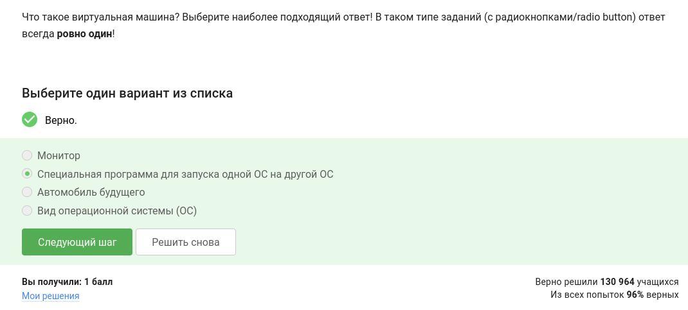!  
Виртуальная машина - программа для запуска 1 ОС на другой ОС.  
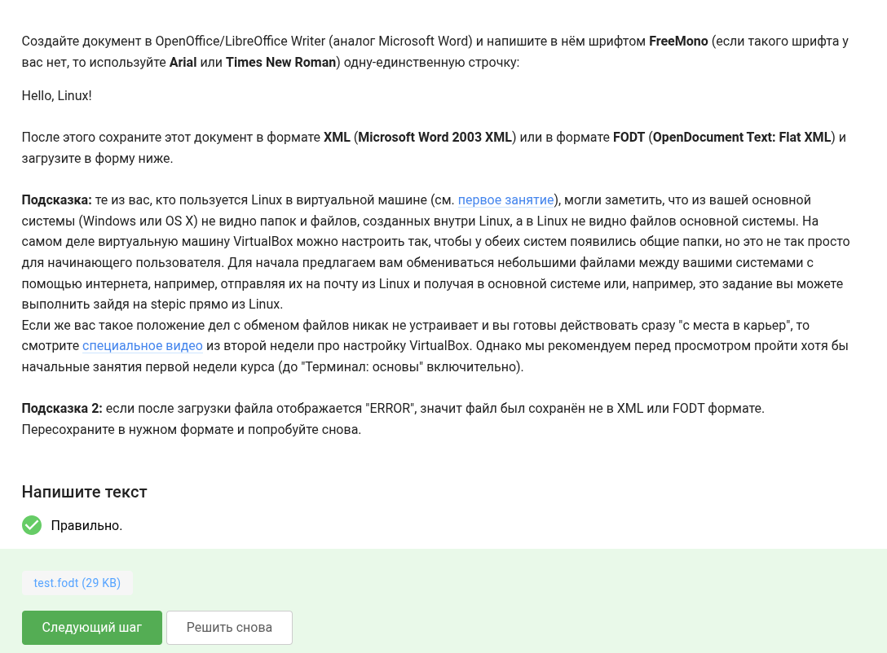!  
Задание для введения в OpenOffice.  
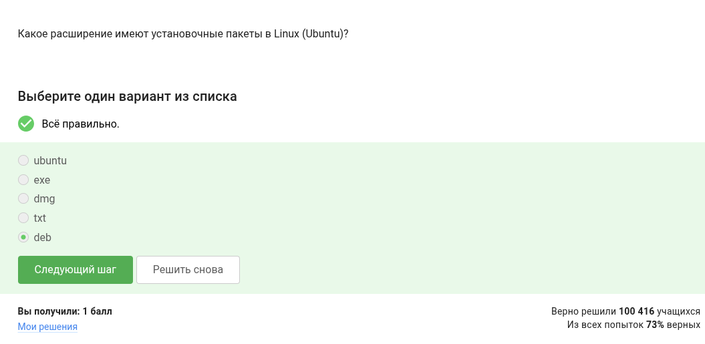!  
deb - расширение установочных пакетов.  
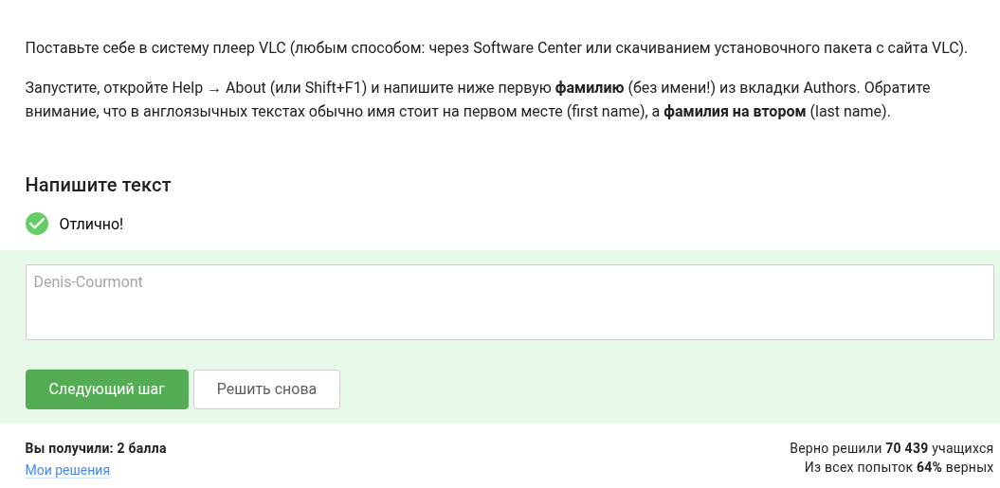!  
Задание для введения в Software Center.  
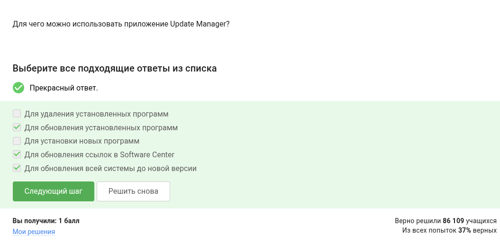!  
Для установки и удаления программ используется Update Manager.  
!  
Консоль и Терминал - синонимы для термина командная строка.  
!  
Остальные варианты неверны, потому что ввод команд чувствителен к регистру.  
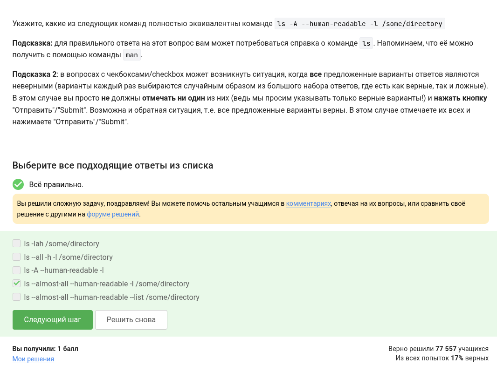!  
-a, --all (do not ignore entries starting with .)  
-A, --almost-all (do not list implied . and ..)  
Аргумента -list не существует, а в третьем варианте не указан путь  
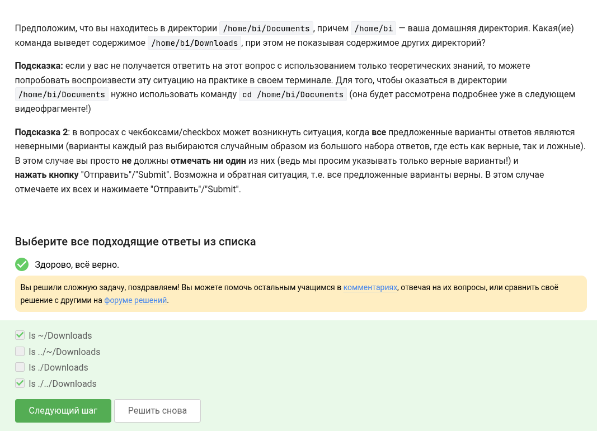!  
Второй вариант возвращает ошибку, третий пытается перейти в Downloads из Documents.  
!  
mkdir - создает директории  
mv - перемещает файлы  
rm -f - удаление без предупреждения  
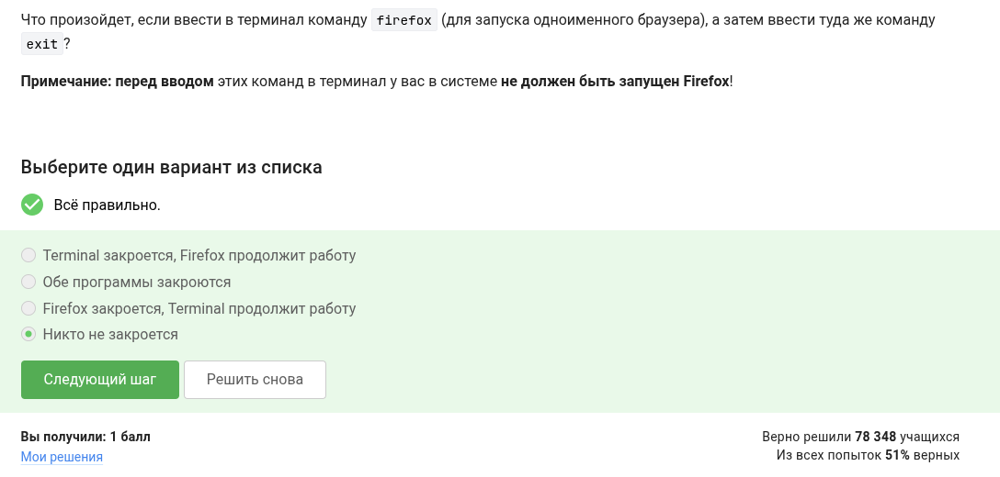!  
При работе приложения из терминала, терминал не отвечает на команды.  
!  
& эквивалентен запуску программы, её приостановке  и переводу в фоновый режим.  
!  
Для вывода в определенный файл надо настроить вывод самому.  
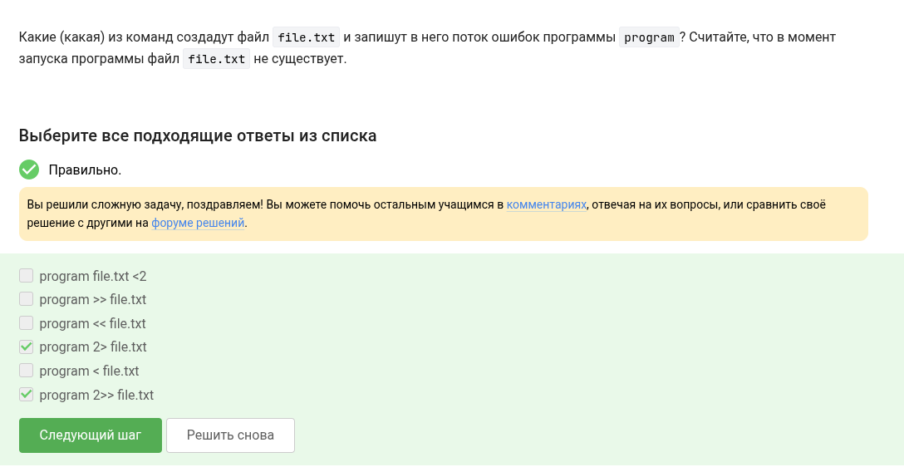!  
Первый, третий и пятый варианты используют символ меньше вместо больше. Второй вариант выводит не поток ошибок.  
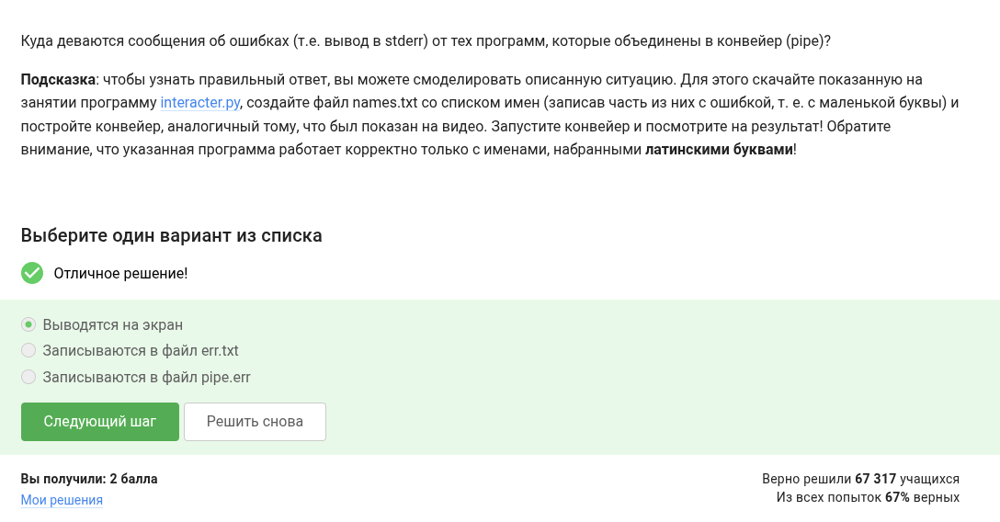!  
Для вывода в определенный файл надо настроить вывод самому.  
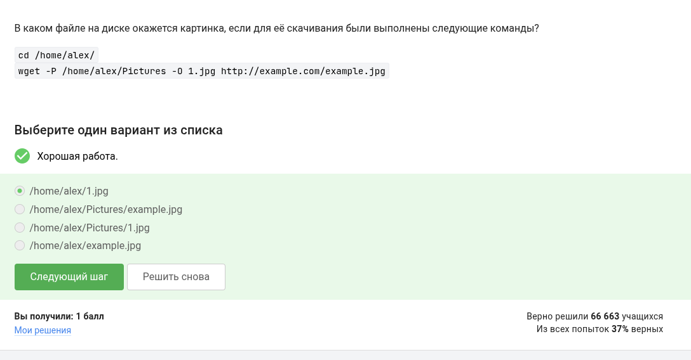!  
Последний аргумент -0 перекрывает собой -P.  
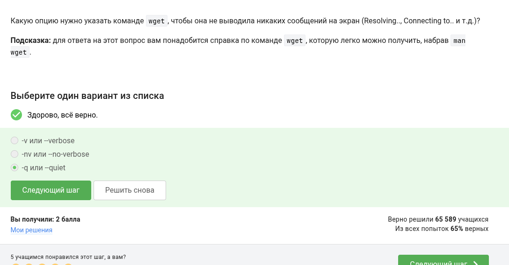!  
Документация по wget даёт понять, что нужна опция -q.  
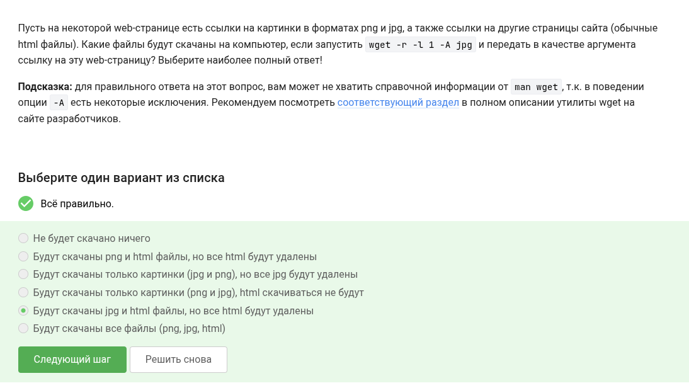!  
Вообще, будут скачаны и png файлы, только они будут отфильтрованы и удалены wget'ом, как и html файлы.  
!  
Не требует объяснений.  
!  
gzip работает с одинм файлом.  
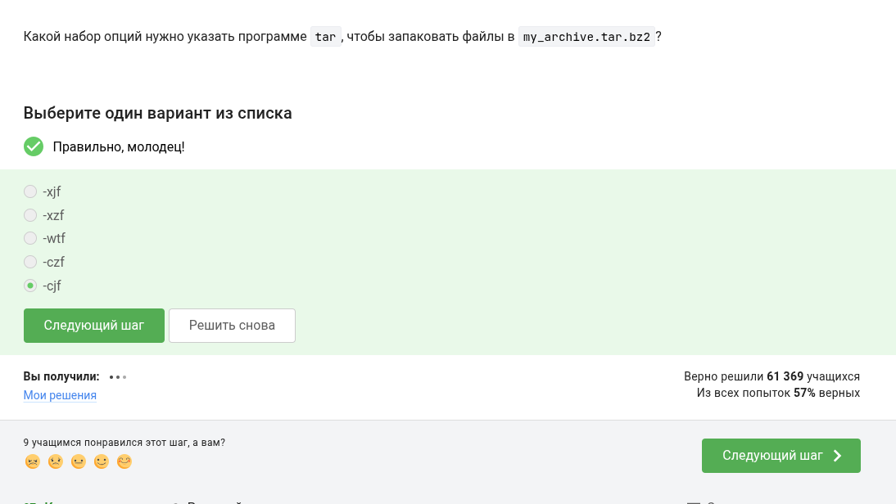!  
-c -f указывают, что надо создать архив. -j указывает, что надо использовать архиватор bzip2, дающий нужное разрешение.  
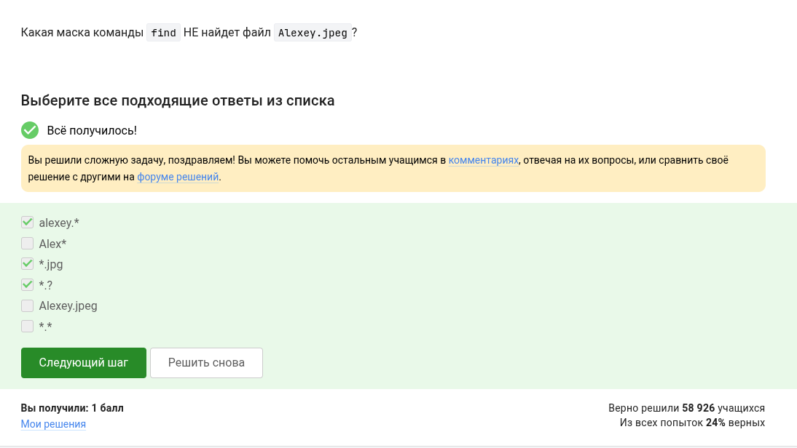!  
Первое не найдется из-за регистра. Второе - из-за несовпадения расширения. Третье - из-за маски, указывающей, что расширение должно быть длиной в один символ.  
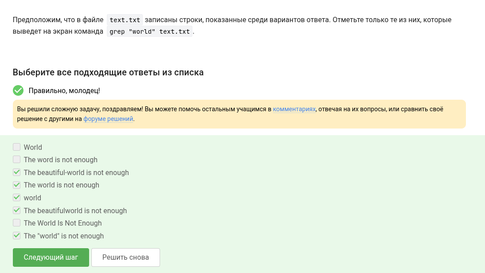!  
Первая и седьмая строки не найдутся из-за регистра. Вторая - из-за того что в ней word, а не world.  
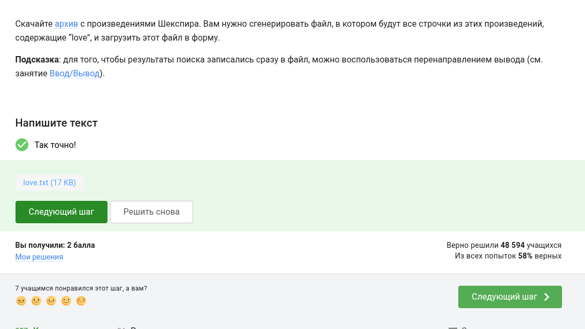!  
Используя аргумент -r, можно вывести все строчки, найденные grep, и записать их в отдельный файл через >.

# Выводы

В результате проделанной работы возросло моё понимание операционной системы Linux. Приобретённые навыки помогут мне в дальнейшем.
