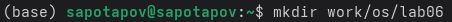
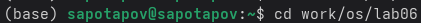
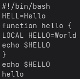
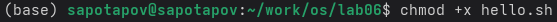
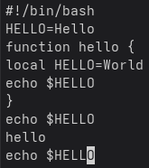
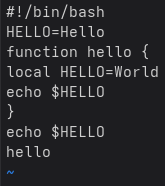

---
## Author
author:
  name: Потапов Савелий Александрович
  degrees: DSc
  orcid: 0000-0002-0877-7063
  email: 1032253503@rudn.ru
  affiliation:
    - name: Российский университет дружбы народов
      country: Российская Федерация
      postal-code: 117198
      city: Москва
      address: ул. Миклухо-Маклая, д. 6

## Title
title: "Отчёт по лабораторной работе "
subtitle: "Потапов С. А. НКАбд-05-25"
license: "CC BY"
---

# Цель работы

Познакомиться с операционной системой Linux. Получить практические навыки работы с редактором vi, установленным по умолчанию практически во всех дистрибутивах.

# Задание
1. Ознакомиться с теоретическим материалом.
2. Ознакомиться с редактором vi.
3. Выполнить упражнения, используя команды vi.

# Выполнение лабораторной работы

\
Я создал новый каталог.\
\
Я перешёл в созданный каталог.\
\
Я создал текстовый файл и вставил в него текст.\
\
Я сделал файл исполняемым.\
\
Я перешёл в режим вставки и заменил часть текста.\
\
Командой u я отменил последнюю команду. Затем, я сохранил изменения в файл и вышел из vi.\

# Контрольные вопросы
1. Режимы vi: командный (ввод команд), ввода текста (вставка/замена), режим последней строки (команды с двоеточием).

2. Выйти без сохранения: :q! (в режиме последней строки).

3. Команды позиционирования: h (влево), j (вниз), k (вверх), l (вправо), 0 (в начало строки), $ (в конец строки), G (конец файла), gg (начало файла), w (к началу следующего слова), b (к началу предыдущего).

4. Слово в vi: последовательность букв, цифр и знаков подчёркивания, ограниченная пробелами, знаками препинания или переводами строк.

5. В начало файла: gg или 1G. В конец файла: G.

6. Группы команд редактирования: удаление (d, dd, x), вставка (i, a, o), замена (r, R, s), копирование (y), вставка из буфера (p, P), отмена (u).

7. Заполнить строку символами $: перейти в командный режим, набрать 70i$Esc (70 — пример длины строки).

8. Отменить действие: u (отмена последнего), U (отмена всех изменений в строке).

9. Группы команд режима последней строки: работа с файлами (:w, :q, :e), поиск (:/pattern, :?pattern), замена (:s/old/new/g), настройки (:set), выход (:q!, :wq).

10. Узнать конец строки без перемещения курсора: команда g$ (показывает позицию последнего символа строки).

11. Опции vi: множество (десятки), узнать список и описание — :set all, значение конкретной — :set option?.

12. Определить режим: в командном режиме нажатия не отображаются на экране, в режиме ввода текст печатается, в режиме последней строки внизу появляется двоеточие.

13. Граф взаимосвязи режимов: командный → (i, a, o, R, s) → режим ввода → (Esc) → командный; командный → (:) → режим последней строки → (Esc или выполнение команды) → командный.

# Выводы
Я получил практические навыки работы с редактором vi, что поможет мне в дальнейшем.

