---
## Author
author:
  name: Потапов Савелий Александрович
  degrees: DSc
  orcid: 0000-0002-0877-7063
  email: 1032253503@rudn.ru
  affiliation:
    - name: Российский университет дружбы народов
      country: Российская Федерация
      postal-code: 117198
      city: Москва
      address: ул. Миклухо-Маклая, д. 6

## Title
title: "Отчёт по лабораторной работе "
subtitle: "Потапов С. А. НКАбд-05-25"
license: "CC BY"
---

# Цель работы
Познакомиться с операционной системой Linux. Получить практические навыки работы с редактором Emacs.

# Задание
Ознакомиться с теоретическим материалом.
Ознакомиться с редактором emacs.
Выполнить упражнения.
Ответить на контрольные вопросы.

# Выполнение лабораторной работы

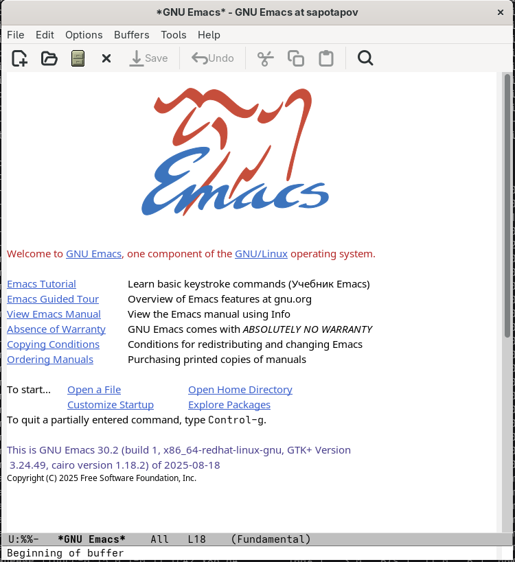\
Я открыл emacs.\
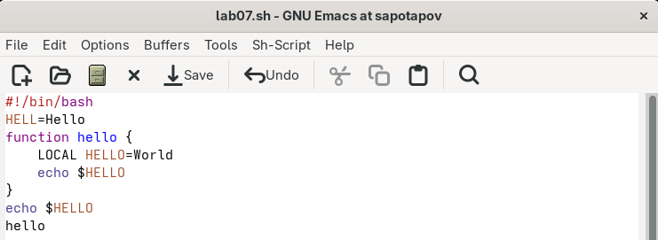\
Я создал файл и набрал текст.\
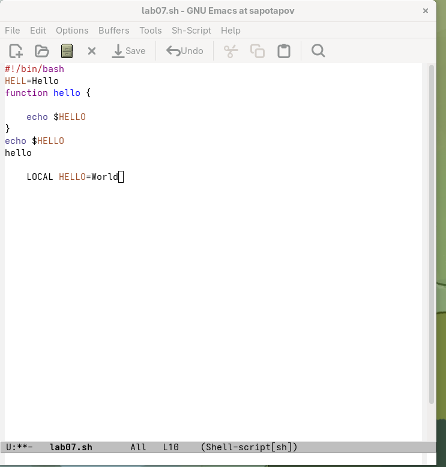\
Я вырезал строку и вставил её в конец файла.\
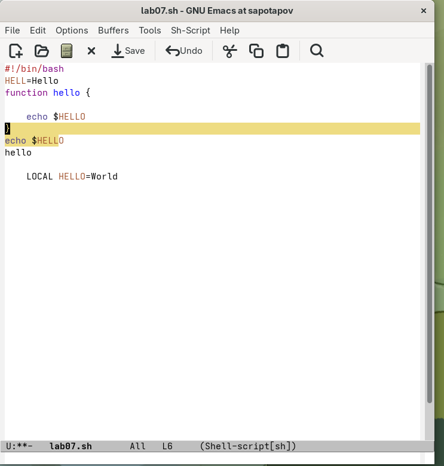\
Я выделил область.\
\
Я вырезал область и вставил её в конец файла.\
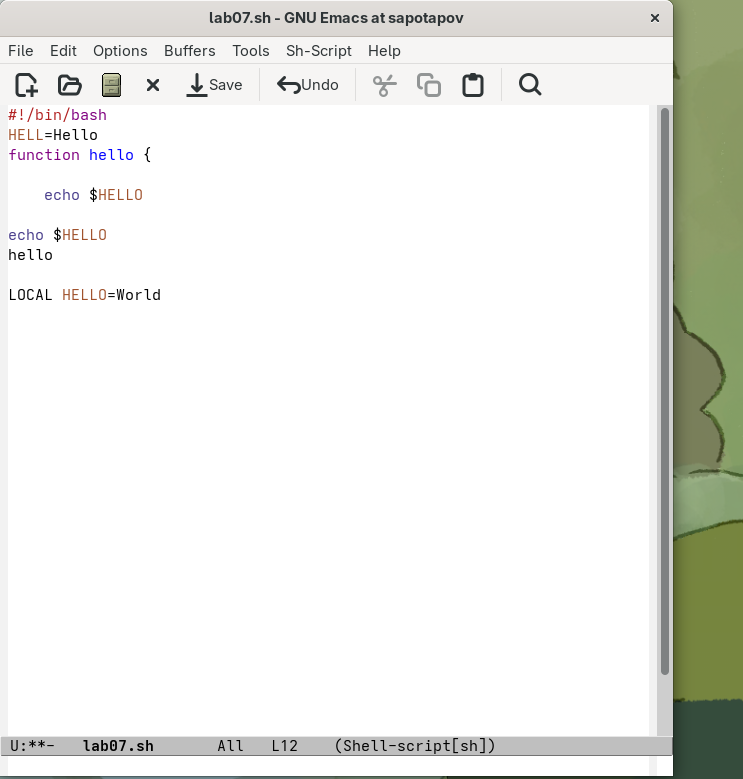\
Я отменил последнее действие.\
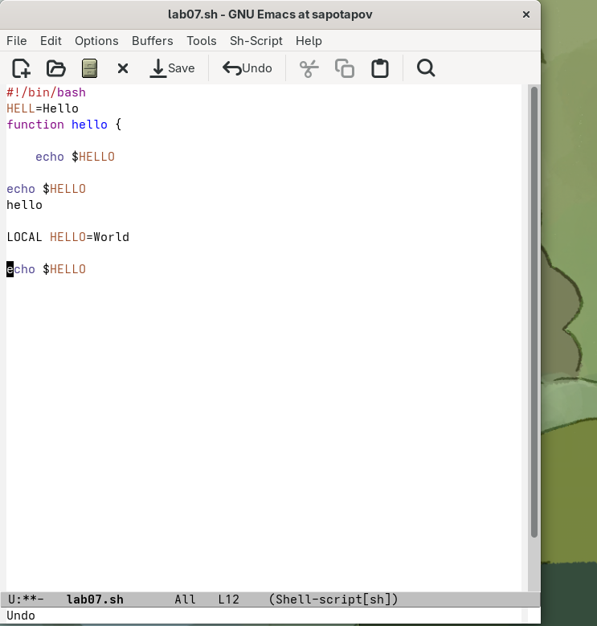\
Я переместил курсор в начало строки.\
\
Я переместил курсор в конец строки.\
\
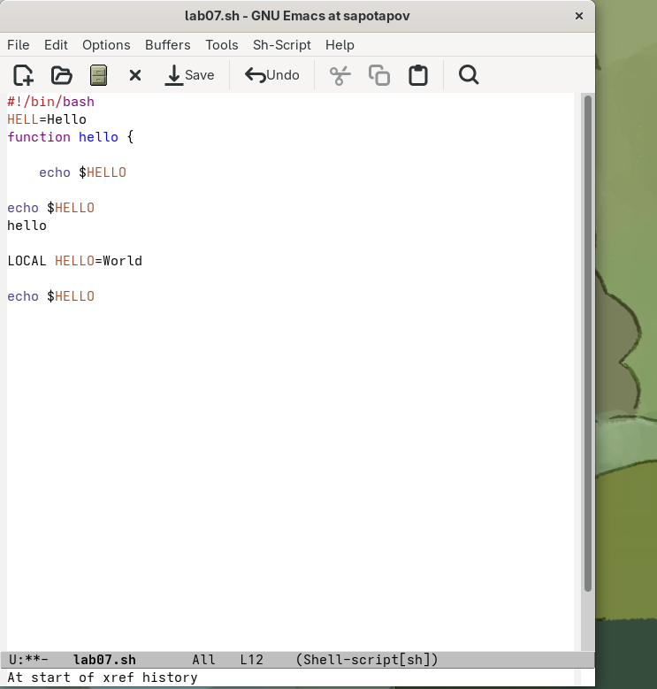\
Я переместил курсор в начало буфера.\
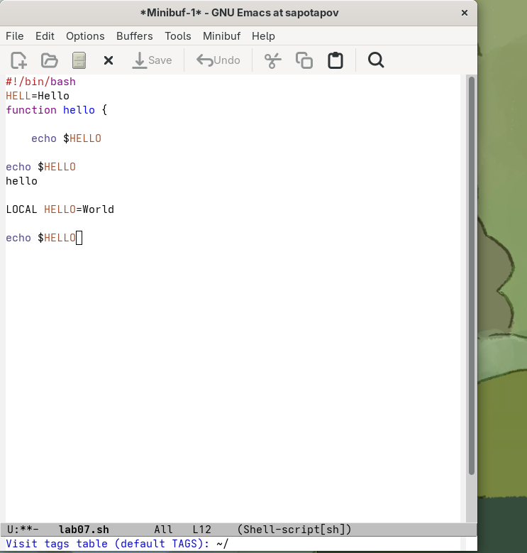\
Я переместил курсор в конец буфера.\
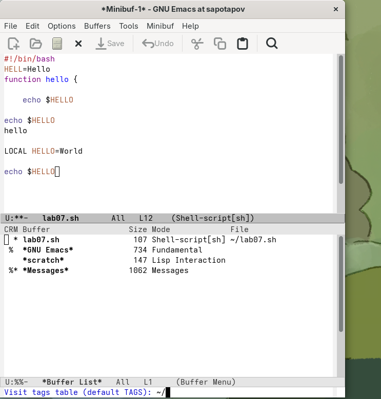\
Я вывел список буферов.\
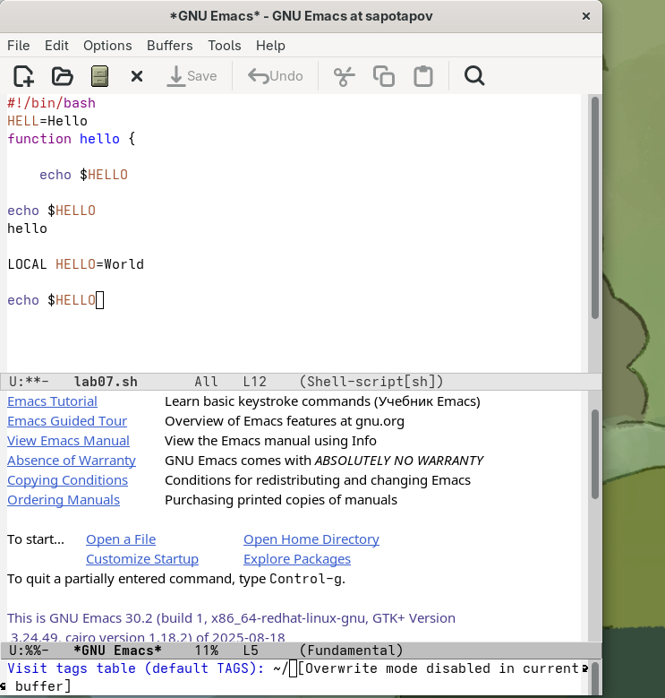\
Я переключился на буфер.\
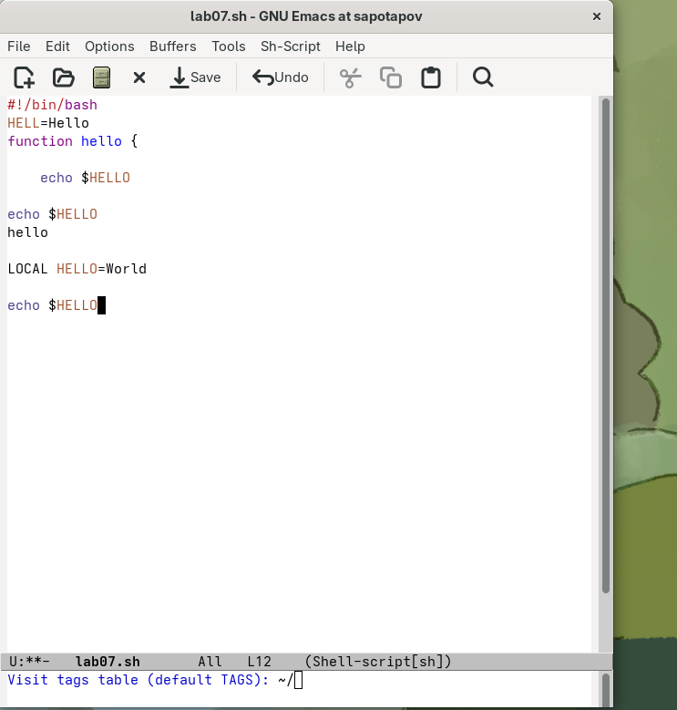\
Я закрыл окно буферов.\
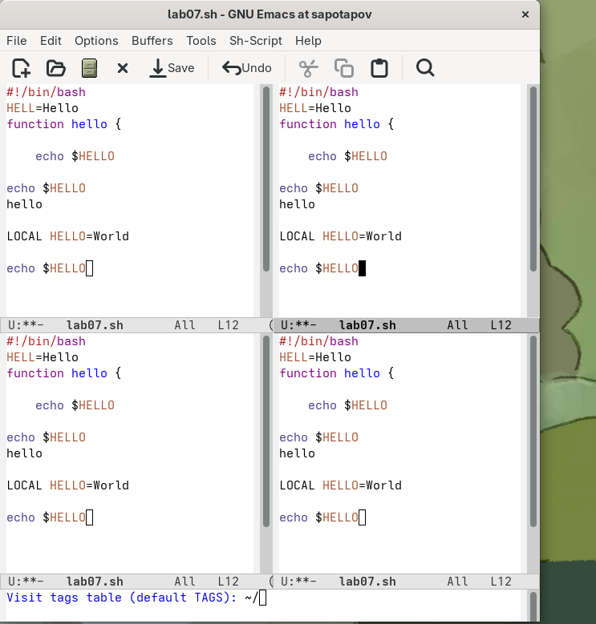\
Я разделил фрейм на 4 части.\
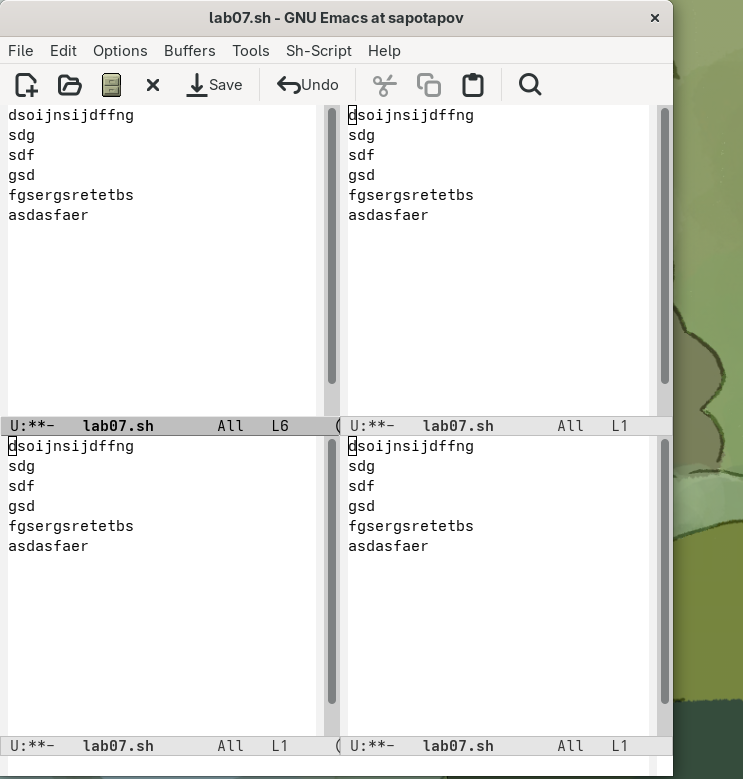\
Я отредактировал текст во всех частях фрейма.\
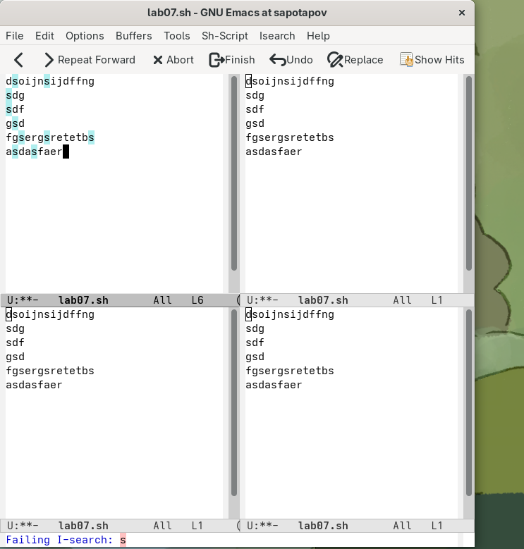\
Я нашёл все вхождения буквы s в текст.\
![рис. 18(image/18.png)\
Я переключился между результатами поиска.\
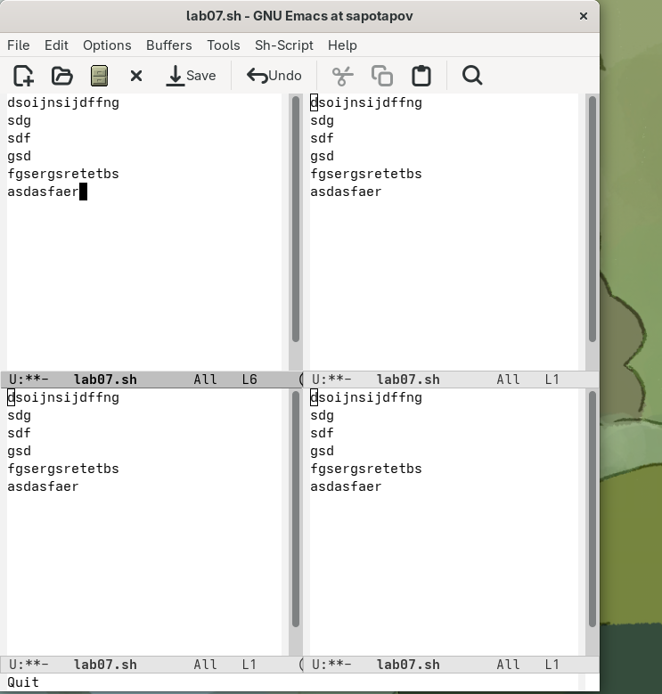\
Я перешёл в режим поиска и замены.\
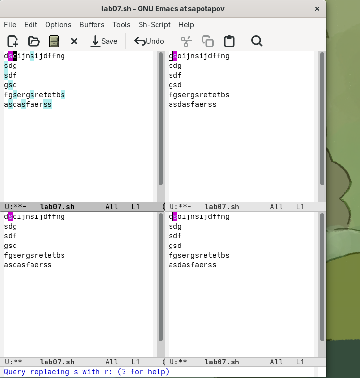\
Я заменил все s на r.\
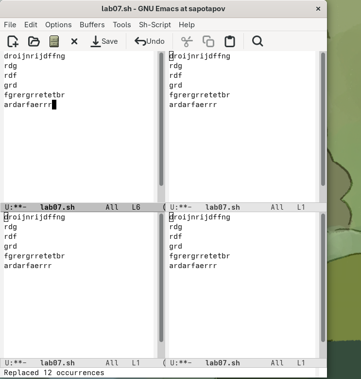\
Я испробовал другой режим поиска. Он отличается от обычного тем, что проверяет по линии за раз.\
# Контрольные вопросы
1. Emacs — это мощный, расширяемый и настраиваемый текстовый редактор с встроенным интерпретатором.

2. Нестандартные комбинации клавиш (Ctrl, Meta), отличные от привычных Ctrl+C, Ctrl+V. Минимальный графический интерфейс в консольной версии.

3. Буфер — это область памяти, содержащая текст. Окно — это видимая область экрана, которая показывает содержимое какого-либо буфера.

4. Да, можно.

5. scratch — черновик. messages — буфер с сообщениями и ошибками Emacs. help — приветственное сообщение и справка. Minibuffer-0 — для ввода команд.

6. С-с: Нажмите и удерживайте Ctrl, затем нажмите c.

C-c C-| : нажмите и удерживайте Ctrl, нажмите c, не отпуская Ctrl, нажмите Shift + \, затем отпустите Ctrl.

7. По горизонтали: C-x 2
По вертикали: C-x 3

8. .emacs или .emacs.d/init.el в домашнем каталоге пользователя.

9. Backspace стирает символ слева от курсора. Переназначить можно абсолютно любую клавишу.

10. Для меня vi показался проще, потому что в нём гораздо проще запомнить комбинации клавиш и не надо переучиваться.
# Выводы
В ходе выполнения работы я освоил навыки работы с текстовым редактором emacs. Эти навыки помогут мне в дальнейшем.
