---
## Author
author:
  name: Потапов Савелий Александрович
  degrees: DSc
  orcid: 0000-0002-0877-7063
  email: 1032253503@rudn.ru
  affiliation:
    - name: Российский университет дружбы народов
      country: Российская Федерация
      postal-code: 117198
      city: Москва
      address: ул. Миклухо-Маклая, д. 6

## Title
title: "Отчёт по лабораторной работе 2"
subtitle: "Потапов С. А. НКАбд-05-25"
license: "CC BY"
---

# Цель работы

- Изучить идеологию и применение средств контроля версий.
- Освоить умения по работе с git.

# Задание

- Создать базовую конфигурацию для работы с git.
- Создать ключ SSH.
- Создать ключ PGP.
- Настроить подписи git.
- Зарегистрироваться на Github.
- Создать локальный каталог для выполнения заданий по предмету.

# Выполнение лабораторной работы

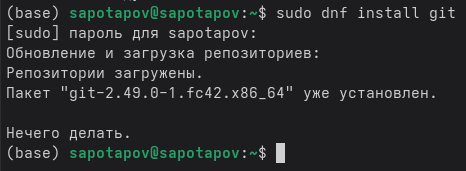\

Я установил git.\
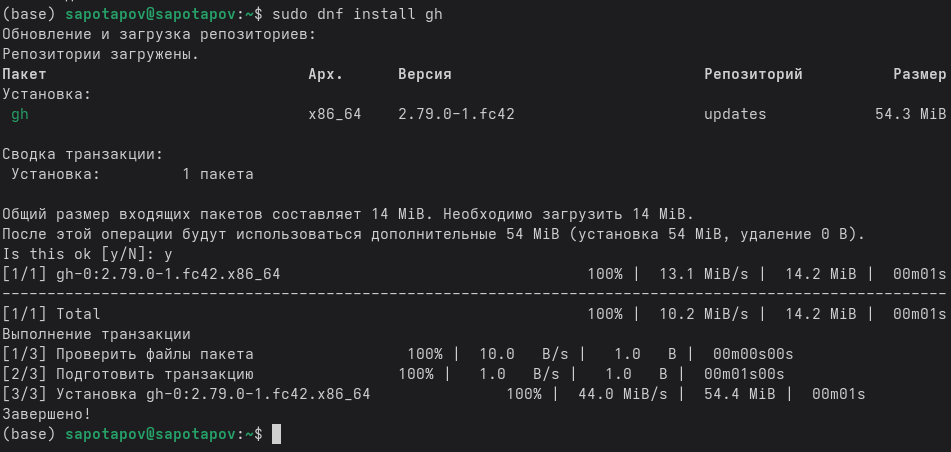\

Я установил gh.\
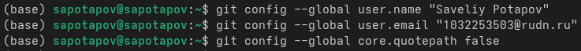\

Была проведена базовая настройка: Я задал своё имя, email, настроил utf-8 в выводе сообщений git.\
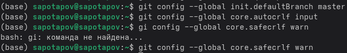\

Я настроил верификацию и подписание коммитов git, задал имя начальной ветки, параметры autocrlf и safecrlf.\
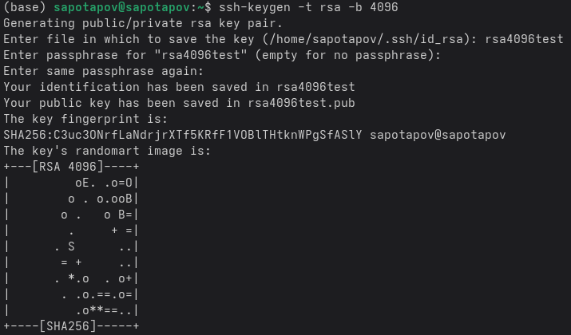\

Я создал ключ по алгоритму rsa с размером 4096 бит.\
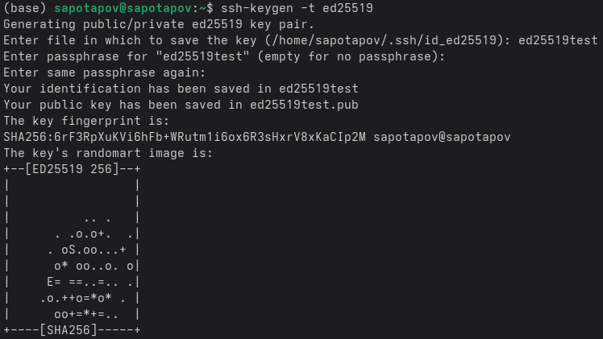\

Я создал ключ по алгоритму ed25519 с размером 4096 бит.\
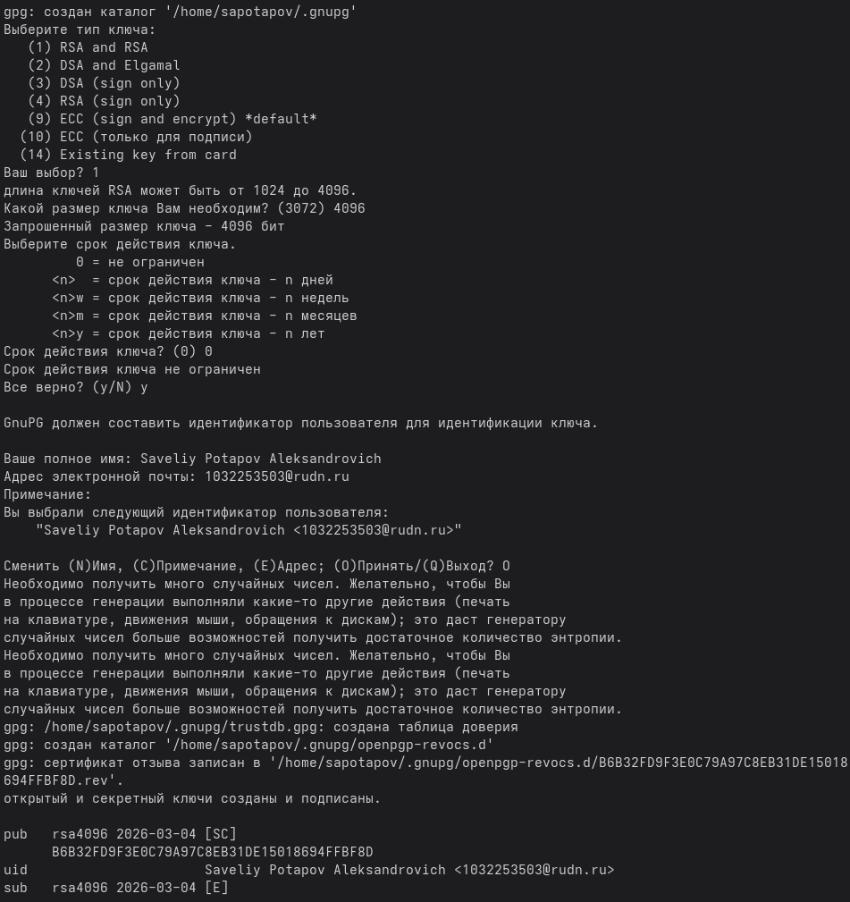\

Я сгенерировал ключ, после чего создал аккаунт на github.com\
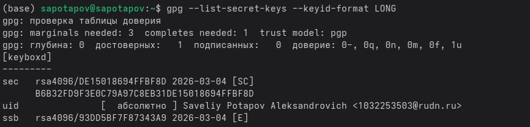\

Я вывел список ключей и скопировал отпечаток приватного ключа.\
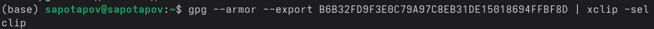\

Я скопировал сгенерированный ключ в буфер обмена.\
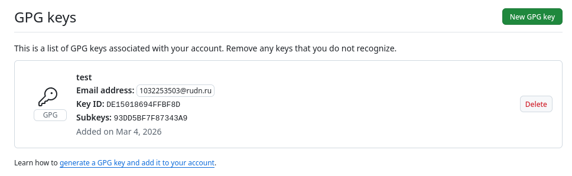\

В настройках Github я вставил свой GPG ключ.\
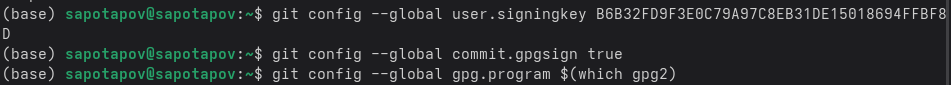\

Я указал Git применять мой адрес электронной почты при подписи коммитов.\
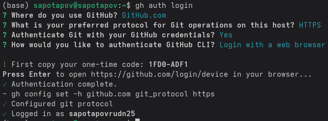\

Я авторизовался в gh.\
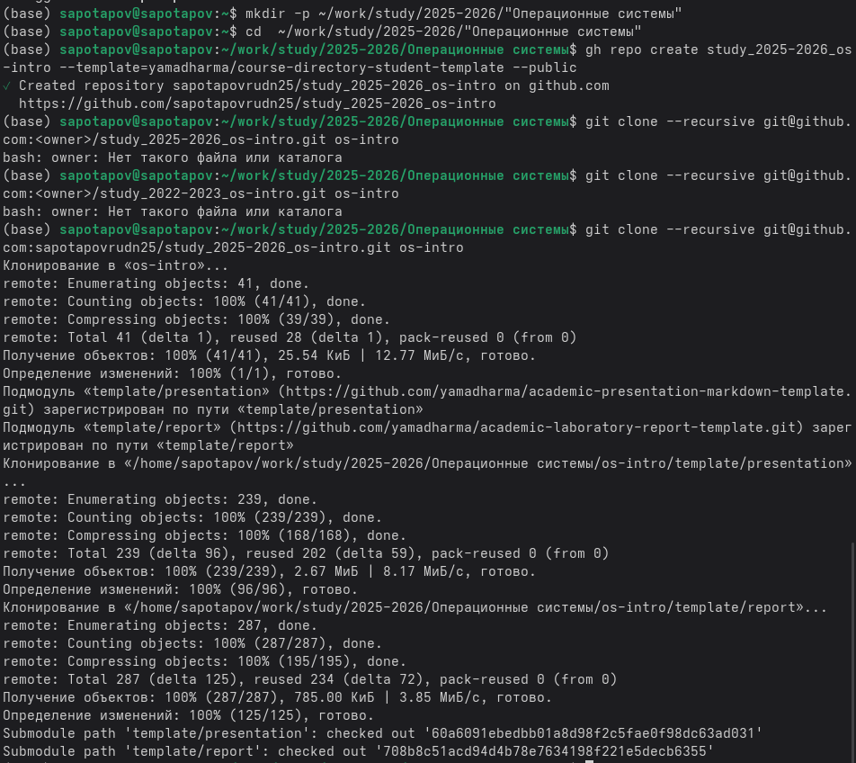\

Я создал директорию для репозитория курса и скопировал сам репозиторий.\
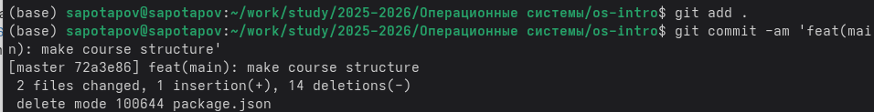\

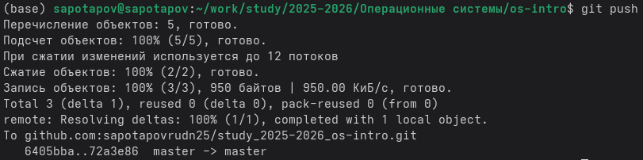\

Я отправил файлы из нового каталога на сервер, зафиксировав коммит.

# Выводы

В процессе проделанной работы я научился работать с системой контроля версий Git через командную строку моего устройства. Эти навыки пригодятся мне в дальнейшем обучении и на работе.

# Ответы на контрольные вопросы
1) Что такое системы контроля версий (VCS) и для решения каких задач они предназначаются?
Система контроля версий - хранилище, содержащее разные версии одного проекта. Она применяется при одновременной работе нескольких человек над одним проектом и позволяет добавлять новые версии, сравнивать версии, совмещать изменения из разных версий, откатывать проект к более ранней версии.

2) Объясните следующие понятия VCS и их отношения: хранилище, commit, история, рабочая копия.
Хранилище - Виртуальное пространство, в котором в котором хранятся различные версии проекта. Commit - версия проекта с указанием изменений. История - Список версий проекта, в котором можно отследить все коммиты по дате. Рабочая копия - локально сохранённая версия проекта, которую изменяют перед тем как загрузить на сервер.

3) Что представляют собой и чем отличаются централизованные и децентрализованные VCS? Приведите примеры VCS каждого вида.
Централизованная модель VCS предполагает наличие единого репозитория для хранения файлов, из которого участники проекта получают нужные им версии файлов. В децентрализованной модели необязательно наличие главного репозитория. Примеры классических VCS: CVS, Subversion. Примеры децентрализованных: Git, Bazaar, Mercurial.

4) Опишите действия с VCS при единоличной работе с хранилищем.
Получаем изменения из центрального репозитория. Вносим изменения на локальном дереве, указываем системе, какие файлы не добавлять в центральный репозиторий. Затем, сохраняем изменения локально, фиксируем их на сервере и размещаем файлы в центральном репозитории.

5) Опишите порядок работы с общим хранилищем VCS.
Получаем изменения из центрального репозитория. Вносим изменения на локальном дереве, указываем системе, какие файлы не добавлять в центральный репозиторий. Затем, сохраняем изменения локально, фиксируем их на сервере и размещаем файлы в центральном репозитории.

6) Каковы основные задачи, решаемые инструментальным средством git?
Git является системой контроля версий, а следовательно, главная задача, решаемая с его помощью - отслеживание различных версий проекта и загрузка их на сервер.

7) Назовите и дайте краткую характеристику командам git.
Создание основного дерева репозитория: git init
Получение обновлений (изменений) текущего дерева из центрального репозитория: git pull
Отправка всех произведённых изменений локального дерева в центральный репозиторий: git push
Просмотр списка изменённых файлов в текущей директории: git status
Просмотр текущих изменений: git diff
Сохранение текущих изменений:
Добавить все изменённые и/или созданные файлы и/или каталоги: git add .
Добавить конкретные изменённые и/или созданные файлы и/или каталоги: git add имена_файлов
Удалить файл и/или каталог из индекса репозитория (при этом файл и/или каталог остаётся в локальной директории): git rm имена_файлов
Сохранение добавленных изменений:
Сохранить все добавленные изменения и все изменённые файлы: git commit -am 'Описание коммита'
Сохранить добавленные изменения с внесением комментария через встроенный редактор: git commit
Создание новой ветки, базирующейся на текущей: git checkout -b имя_ветки
Переключение на некоторую ветку(при переключении на ветку, которой ещё нет в локальном репозитории, она будет создана и связана с удалённой): git checkout имя_ветки 
Отправка изменений конкретной ветки в центральный репозиторий: git push origin имя_ветки
Слияние ветки с текущим деревом: git merge --no-ff имя_ветки
Удаление ветки:
Удаление локальной уже слитой с основным деревом ветки: git branch -d имя_ветки
Принудительное удаление локальной ветки: git branch -D имя_ветки
Удаление ветки с центрального репозитория: git push origin :имя_ветки

8) Приведите примеры использования при работе с локальным и удалённым репозиториями.
Локальный репозиторий - локально сохранённая версия репозитория, в которую мы вносим изменения перед тем как загрузить их на удалённый репозиторий. Удалённый репозиторий же используется для получения версии проекта и принимает загруженные изменения.

9) Что такое и зачем могут быть нужны ветви (branches)?
Ветви используются, чтобы изолировать изменения проекта без риска нарушить работу главной версии. После завершения работы с ветвью, её можно объединить ("merge") с главной ветвью репозитория.

10) Как и зачем можно игнорировать некоторые файлы при commit?
Во время работы над проектом могут создаваться файлы, которые не требуется добавлять в последствии в репозиторий. Например, временные файлы, создаваемые редакторами, или объектные файлы, создаваемые компиляторами. Можно прописать шаблоны игнорируемых при добавлении в репозиторий типов файлов в файл .gitignore с помощью сервисов. 

::: {#refs}
:::
