---
## Author
author:
  name: Потапов Савелий Александрович
  degrees: DSc
  orcid: 0000-0002-0877-7063
  email: 1032253503@rudn.ru
  affiliation:
    - name: Российский университет дружбы народов
      country: Российская Федерация
      postal-code: 117198
      city: Москва
      address: ул. Миклухо-Маклая, д. 6

## Title
title: "Отчёт по лабораторной работе "
subtitle: "Потапов С. А. НКАбд-05-25"
license: "CC BY"
---

# Цель работы

- Приобретение практических навыков взаимодействия пользователя с системой посредством командной строки

# Задание

Определите полное имя вашего домашнего каталога. Далее относительно этого ката-
лога будут выполняться последующие упражнения.
2. Выполните следующие действия:
2.1. Перейдите в каталог /tmp.
2.2. Выведите на экран содержимое каталога /tmp. Для этого используйте команду ls
с различными опциями. Поясните разницу в выводимой на экран информации.
2.3. Определите, есть ли в каталоге /var/spool подкаталог с именем cron?
2.4. Перейдите в Ваш домашний каталог и выведите на экран его содержимое. Опре-
делите, кто является владельцем файлов и подкаталогов?
3. Выполните следующие действия:
3.1. В домашнем каталоге создайте новый каталог с именем newdir.
3.2. В каталоге ~/newdir создайте новый каталог с именем morefun.
3.3. В домашнем каталоге создайте одной командой три новых каталога с именами
letters, memos, misk. Затем удалите эти каталоги одной командой.
3.4. Попробуйте удалить ранее созданный каталог ~/newdir командой rm. Проверьте,
был ли каталог удалён.
3.5. Удалите каталог ~/newdir/morefun из домашнего каталога. Проверьте, был ли
каталог удалён.
4. С помощью команды man определите, какую опцию команды ls нужно использо-
вать для просмотра содержимое не только указанного каталога, но и подкаталогов,
входящих в него.
5. С помощью команды man определите набор опций команды ls, позволяющий отсорти-
ровать по времени последнего изменения выводимый список содержимого каталога
с развёрнутым описанием файлов.
6. Используйте команду man для просмотра описания следующих команд: cd, pwd, mkdir,
rmdir, rm. Поясните основные опции этих команд.
7. Используя информацию, полученную при помощи команды history, выполните мо-
дификацию и исполнение нескольких команд из буфера команд.

# Выполнение лабораторной работы

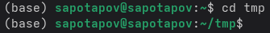\
Я перешел в tmp.\
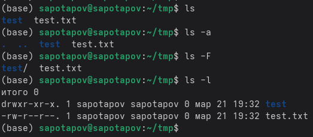\
Я вывел на экран содержимое tmp, затем содержимое включая скрытые файлы, затем файлы с расширениями, затем расширенные сведения о файле - показывая разрешения, создателя, размер, дату, время создания\
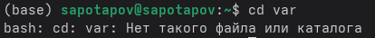\
У меня нет такого каталога, а следовательно и подкаталога cron.\
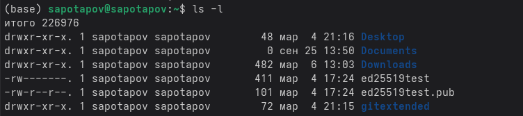\
Владелец файлов и подкаталогов - sapotapov (я)\
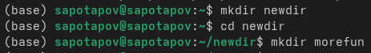\
Я создал nedwir/morefun\
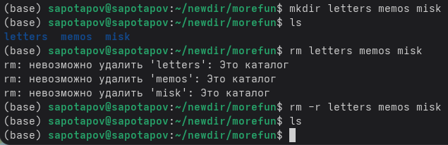\
Я создал 3 каталога, затем удалил их одной командой.\
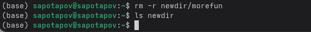\
Я удалил newdir/morefun.\
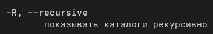\
-r показывает подкаталоги каталогов.\
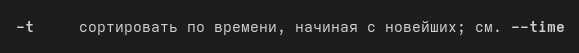\
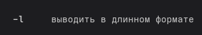\
-tl сортирует по времени изменения список с развернутым описанием файлов.\
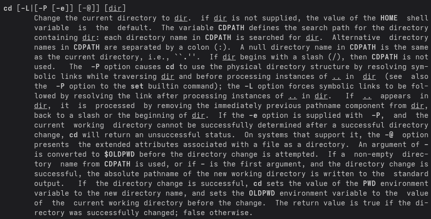\
cd - меняет директорию на выбранную.\
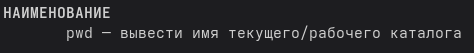\
pwd выводит имя текущего каталога\
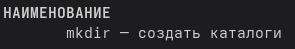\
mkdir создает каталоги\
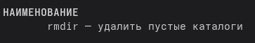\
rmdir удаляет пустые каталоги\
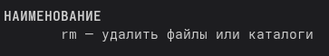\
rm удаляет файлы или каталоги\
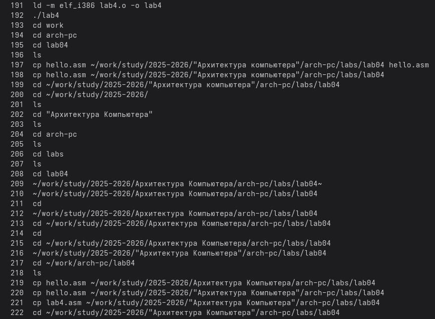\
Я вывел историю команд при помощи history.\

# Контрольные вопросы
1) Командная строка - текстовый интерфейс для взаимодействия с операционной системой.
2) При помощи команды pwd
3) ls -f
4) используя ls -a
5) при помощи rm -r
6) командой history
7) !! - повторить последнюю команду, !n - повторить команду с номером n из истории, ^old^new - заменить old на new в последней команде и выполнить
8) cd /tmp && rm -f temp.txt ; echo "Готово" - переключается на tmp, удаляет temp.txt если выполнилась первая часть команды и выводит "Готово".
9) Обратный слеш перед специальным символом позволяет использовать его как обычный символ, как и заключение в кавычки
touch Файл\ с\ пробелом.txt - создает "Файл с пробелом.txt"
10)Команда ls -l выводит подробный список файлов в длинном формате. Каждая строка содержит тип файла и права доступа (например, -rw-r--r--), количество жёстких ссылок, имя владельца, имя группы, размер в байтах, дата и время последней модификации, имя файла.
11) Относительный путь - расположение файла относительно текущего каталога
rm ../other/file.txt - удаляет файл file.txt из каталога other, находящегося на один каталог выше
12) man [команда]
13) tab\

# Выводы

В процессе выполнения этой лабораторной работы, мною были получены навыки работы с командной строкой, которые помогут мне в дальнейшем.
